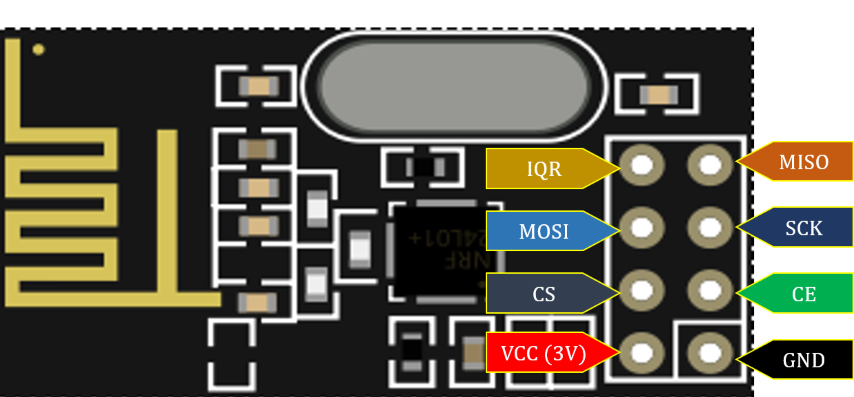

# Face-Following-Robot-using-Distance-Estimation
This Robot will follow the Face and according to The Distance Estimation using Computer Vision, without and Sensor Then a Single Camera 
## Robot Image 

## Hardware Required 

Name | Items
-----|------
Arduino | 2
NRF24L01|2
L298 Motor Dirver|1 
Power Supply 12 Volts| 1
RGB LED |1 optional
jumper Wires| 40+
breadboard Half(size) | 1 or 2

## Software Required 
- **Arduino IDE**
    - NRF Library 

- **Python Modules**
    - Opencv
        - Opencv for image processing   
    - Pyserial
        - Pyserial allow us to communicate between python(Software) and Arduino (Hardware) 
- **Iriun WebCam**
    - It will convert smartphone as wireless camera for us
    - Download software for Windows Linux, and Mac : https://iriun.com/  
    - My Tutorial on **Iriun Webcam** Link: https://youtu.be/0jGcbJdqQ1k
## Circuit Diagrams

### Arduino Nano Connection With NRF
 
 

NRF Connection

 
 

 
 

### Motor Driver Connection With Arduino Nano
 
 

 
 

